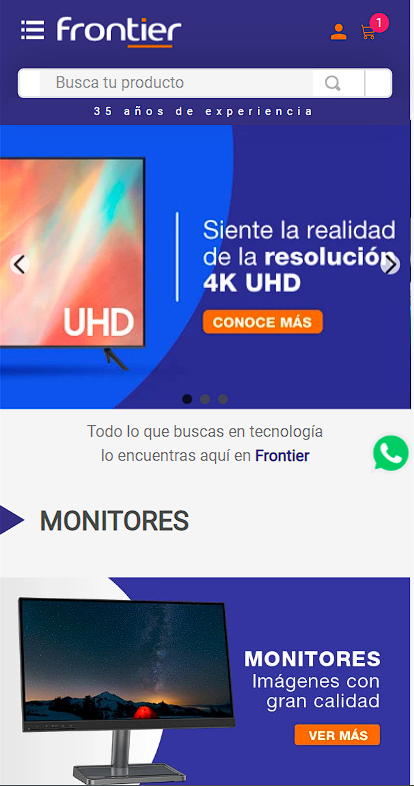
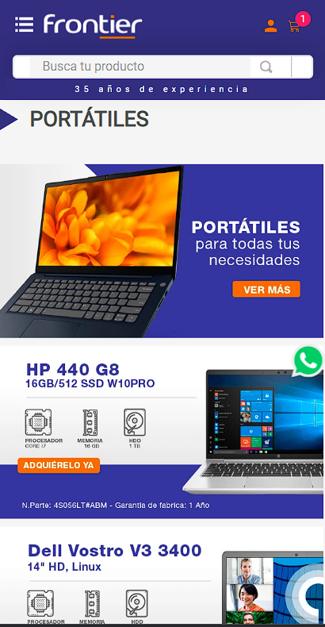
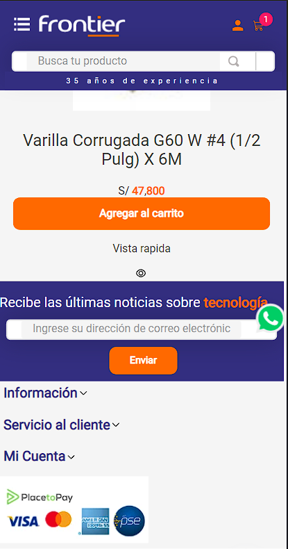
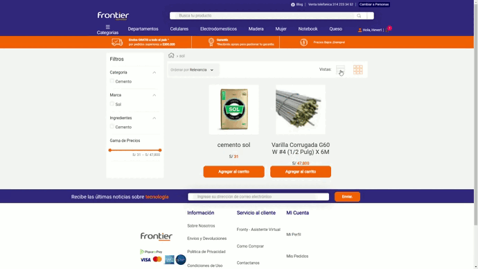
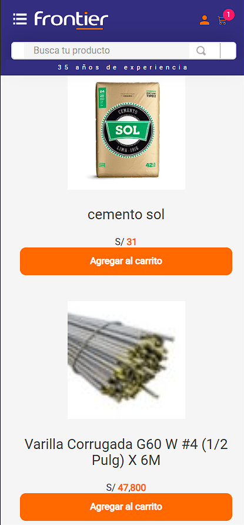
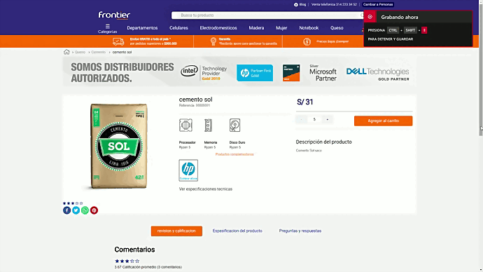
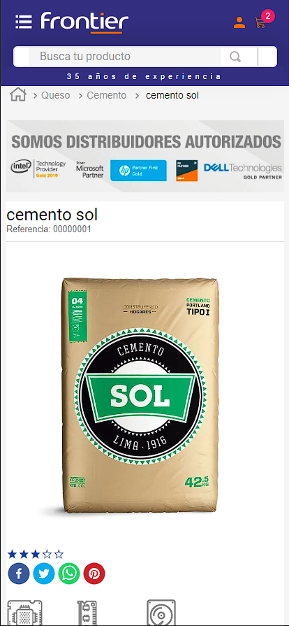
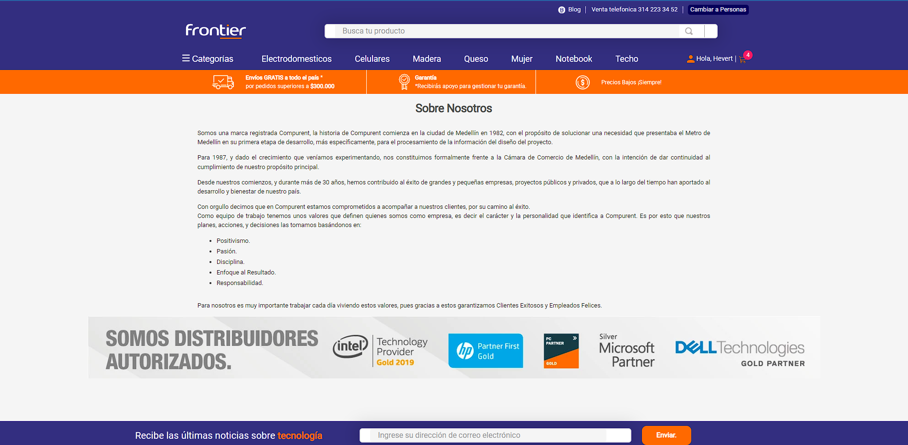
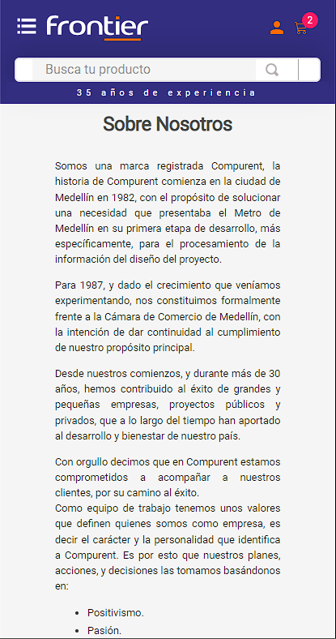

# Store Theme Frontier  
<center> VTEX-Store-Theme-Frontier fue realizado la tecnología vtex io. </center>


https://frontier.com.co/ fue la tienda elegida para realizar el clon de este proyecto, teniendo en cuenta las distintas dimensiones de las pantallas, tanto en mobile y como en desktop

## Galería de imágenes 

 <center> Versión Desktop Home </center>


 <center> Versión Desktop Mobile Home </center>






### Page List Product
 <center> Versión Desktop List Product </center>




 <center>Versión Mobile List Product </center>



#### Page Detail Product
 <center> Versión Desktop Home </center>




 <center> Versión Mobile Home </center>



#### Custom Page

 <center> Versión Desktop Home </center>



 <center> Versión Mobile Home </center>




## Configuración
### Paso 1 - Configuración básica

Acceda a la [guía de configuración básica](https://vtex.io/docs/getting-started/build-stores-with-store-framework/1) de VTEX IO y siga todos los pasos indicados.

Al final de la configuración, debe tener instalada la interfaz de línea de comandos de VTEX (Toolbelt) junto con un espacio de trabajo de desarrollador en el que puede trabajar.

### Paso 2 - Clonación del repositorio

[Clonar](https://github.com/LauraCastellanos13/VTEX-Store-Theme-Olimpica) este repositorio en sus archivos locales para poder comenzar a trabajar en él de manera efectiva.

Luego, acceda al directorio del repositorio usando su terminal.

### Paso 3 - Editar Manifest.json

Una vez en el directorio del repositorio, es hora de editar el archivo `manifest.json` de la plantilla mínima.

Una vez que esté en el archivo, debe reemplazar los valores `vendor` y `account`. `vendor` es el nombre de la cuenta en la que está trabajando y `account` es cualquier nombre que desee para su tema. Por ejemplo:

```json
{
   "vendor": "itgloberspartnercl",
   "name": "store-theme"
}
```

### Paso 4 - Instalar apps 

Para usar el Store Framework y trabajar en el tema de su tienda determinada, es necesario tener instalados `vtex.store-sitemap` y `vtex.store`.

Podrá ejecutar el comando `vtex list` y verificar si esas aplicaciones ya están instaladas, en su defecto, si no lo están, ejecute el comando: `vtex install vtex.store-sitemap vtex.store -f` para instarlos respectivamente.

### Paso 5 - Desinstalar el store-theme predeterminado

Al ejecutar `vtex list`, puede verificar si algún tema está instalado.

Es común tener ya instalado un `vtex.store-theme` cuando inicia el proceso de desarrollo frontal de la tienda.

Por lo tanto, si lo encuentra en la lista de aplicaciones, copie su nombre y utilícelo junto con el comando `vtex uninstall`. Por ejemplo:

```json
vtex uninstall vtex.store-theme
```

### Paso 6 - Revisar las dependencias y builders necesarios

Una vez modificada esa sección del `manifest.json`, se debe rectificar que el repositorio contenga las siguientes dependencias y los builders necesarios:
### Builders 

```
{
    "styles": "2.x",
    "store": "0.x",
    "docs": "0.x",
    "assets": "0.x"
}
```

###  Dependencies

```
{
    "vtex.store": "2.x",
    "vtex.store-header": "2.x",
    "vtex.product-summary": "2.x",
    "vtex.store-footer": "2.x",
    "vtex.store-components": "3.x",
    "vtex.styleguide": "9.x",
    "vtex.slider": "0.x",
    "vtex.carousel": "2.x",
    "vtex.shelf": "1.x",
    "vtex.menu": "2.x",
    "vtex.minicart": "2.x",
    "vtex.product-details": "1.x",
    "vtex.product-kit": "1.x",
    "vtex.search-result": "3.x",
    "vtex.login": "2.x",
    "vtex.my-account": "1.x",
    "vtex.flex-layout": "0.x",
    "vtex.rich-text": "0.x",
    "vtex.store-drawer": "0.x",
    "vtex.locale-switcher": "0.x",
    "vtex.product-quantity": "1.x",
    "vtex.product-identifier": "0.x",
    "vtex.product-specification-badges": "0.x",
    "vtex.product-review-interfaces": "1.x",
    "vtex.telemarketing": "2.x",
    "vtex.order-placed": "2.x",
    "vtex.stack-layout": "0.x",
    "vtex.tab-layout": "0.x",
    "vtex.responsive-layout": "0.x",
    "vtex.slider-layout": "0.x",
    "vtex.iframe": "0.x",
    "vtex.breadcrumb": "1.x",
    "vtex.sticky-layout": "0.x",
    "vtex.add-to-cart-button": "0.x",
    "vtex.store-icons": "0.x",
    "vtex.store-image": "0.x",
    "vtex.store-link": "0.x",
    "vtex.modal-layout": "0.x",
    "vtex.search": "1.x",
    "vtex.checkout-summary": "0.x",
    "vtex.disclosure-layout": "1.x",
    "vtex.store-newsletter": "1.x",
    "vtex.product-list": "0.x",
    "vtex.product-price": "1.x"
    }
```
### PeerDependencies

```
{
  "vtex.mega-menu": "2.x",
   "vtex.questions-and-answers": "0.x",
  "vtex.wish-list": "1.x"
}
```

### Custom Apps

```
{
    "itgloberspartnercl.whatsapp-button": "0.x",
    "itgloberspartnercl.button-up": "0.x",
    "itgloberspartnercl.bullets-diagramation": "0.x",
    "itgloberspartnercl.add-to-cart-info": "0.x"


}
```


### Paso 7 - Ejecute un preview de la tienda

Para cargar los archivos locales a la plataforma, use el comando `vtex link`.

Si el proceso se ejecuta sin ningún error, se mostrará el mensaje: `Aplicación vinculada con éxito`. Luego, se tednrá que ejecutar el comando `vtex browser` para abrir una ventana del navegador.

Esto permitirá ver los cambios aplicados en tiempo real, a través de la cuenta y el espacio de trabajo en el que está trabajando.

## developed by
1.  ### Hevert David Gelis Diaz  🧑‍💻

